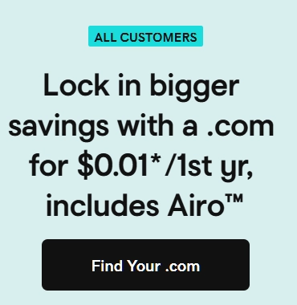

# 怎么给自己的网店找个靠谱的"地基"？

开网店就像盖房子，你得先有块稳固的地基。听起来挺虚的，但这事儿是真的——你的服务器托管（也就是hosting）要是不行，网站三天两头打不开，顾客想买东西都买不了，这生意还怎么做？

问题是，市面上hosting服务商太多了，看得人眼花缭乱。价格从每月1美元到51美元不等，功能说明写得天花乱坠，你根本不知道哪个真正适合自己。选错了，网站慢得让人想砸电脑，或者突然挂掉，损失的可都是真金白银。

这篇文章就是帮你理清这些事儿。我们整理了10个靠谱的hosting服务商，重点看两件事：**安全性**（别让客户信息泄露）和**可扩展性**（生意做大了服务器跟得上）。说人话，不玩虚的。

---

## 选hosting要看什么？别只盯着价格

很多人选hosting就看价格，便宜就上。但开网店和做个人博客不一样，有些东西不能省。

### 安全功能：别让你的店成为黑客的提款机

你的网店里都是客户的支付信息、个人资料，这些东西要是泄露了，不光是赔钱的问题，名声也毁了。所以这几个安全功能必须有：

- **SSL证书**：这玩意儿能把你网站和客户之间传输的数据加密，信用卡号之类的敏感信息不会被人轻易偷走。现在靠谱的hosting都免费送SSL，这是最基本的。

- **DDoS防护和防火墙**：有人恶意攻击你网站怎么办？大量假流量涌进来，服务器扛不住就瘫痪了。好的hosting会有DDoS防护，像个保安一样把坏流量拦在门外。

- **恶意软件扫描**：网站被植入病毒或木马，你自己可能都不知道。hosting应该定期扫描、清理这些东西。

- **定期备份**：万一出事了，至少还有个备份能恢复。有的服务商提供每天备份，有的是每周，这个很重要。

- **PCI DSS合规**：如果你直接在网站上收信用卡付款（不是跳转到第三方支付），就必须符合这个标准，不然有法律风险。

如果你的业务需要处理大量敏感交易，强大的服务器安全保障绝对不能少。👉 [Vultr提供企业级安全防护，数据中心遍布全球，让你的在线业务24小时安全运转](https://www.vultr.com/?ref=9738262-9J)，特别适合需要高安全标准的电商场景。

### 可扩展性：今天10个订单，明天1000个，服务器能顶得住吗?

生意做起来是好事，但如果你的hosting扛不住流量，网站一崩，好事就变坏事了。所以要选那些能**随着你业务增长而升级**的服务商。

几个关键指标：

- **在线时间保证（Uptime）**：好的服务商承诺99.9%甚至100%在线。这意味着你的店几乎不会"闭门谢客"。

- **加载速度**：页面打开慢，客户就跑了。有的服务商能做到150-300毫秒打开网页，这速度够快。

- **应对流量高峰**：搞促销活动，突然来了一大波访客，服务器不能卡。这就需要hosting有**负载均衡**之类的技术。

hosting的类型也影响扩展能力：

- **共享主机**：最便宜，但资源和别人共用，就像合租房子。适合刚起步的小店。
- **VPS（虚拟专用服务器）**：有自己独立的资源，比共享主机强，价格中等。
- **云托管**：最灵活，流量大了自动加资源，流量小了就减，按用量付费。

还有个容易被忽视的点：**数据中心位置**。如果你的客户在全球各地，服务商在多个国家有数据中心会更快。比如ScalaHosting在10个国家有机房，Hostinger在8个国家有，而Bluehost只在美国，国际客户访问可能就慢一些。

### 电商专用工具：让开店更省事

有些hosting专门为网店优化，提供一些特别实用的功能：

- **一键安装**：想用WooCommerce或Shopify？点一下就装好，不用折腾代码。
- **支付网关兼容**：能顺畅对接PayPal、Stripe这些支付工具，客户付款方便。
- **AI工具**：比如Hostinger有AI网站生成器，不懂技术也能快速搭建店铺。

### 客服支持：网站半夜崩了找谁？

网店是24小时营业的，问题也可能随时出现。所以**24/7客服**是标配，最好能实时聊天或打电话，邮件太慢了。

### 价格：不只看标价，还要看性价比

便宜的每月1美元，贵的50多美元。但别光看入门价，有些服务商续费时会涨价。另外看看包含什么：免费域名、SSL、邮箱、CDN（让网站在全球各地都快）这些加起来价值不小。

很多服务商有**退款保证**，比如30天不满意退钱，可以试试再决定。

---

## 10个值得考虑的hosting服务商

这里我们逐个看看这些服务商的特点，帮你对比。

### 1. Hostinger：性价比之王

**特点**：增长最快的hosting公司，速度快价格低，还有AI工具加持。

**适合谁**：预算有限的中小店铺，特别是用WordPress/WooCommerce的。

他们有一键安装WordPress，自动更新，还有测试环境让你试验新功能。最酷的是AI网站生成器和AI内容助手，不懂技术的人也能搞定。

**安全性**：免费SSL、每周备份、DDoS防护、服务器监控，这些都有。

**可扩展性**：基础套餐50GB存储，在8个国家有数据中心，承诺100%在线时间。网站加载只要0.904秒，反应时间60.3毫秒，快得很。

**价格**：月费3.59美元起（常有折扣），30天退款保证。

**客服**：24/7在线聊天和邮件支持（没电话）。

**优点**：便宜、快、AI工具好用、全球覆盖、送域名。  
**缺点**：不能打电话客服。

---

### 2. Bluehost：WordPress官方推荐

**特点**：WordPress.org官方推荐，特别适合WooCommerce店铺。

**适合谁**：用WordPress做店的，需要大存储空间和快速客服的。

他们的WooCommerce套餐包括礼品卡、在线支付、商品筛选等功能，还能卖无限数量的产品。

**安全性**：免费SSL、每日备份、恶意软件扫描，还有付费增强安全选项。

**可扩展性**：基础套餐100GB存储，测试显示在线时间99.18%。但数据中心只在美国。

**价格**：月费7.45美元起。

**客服**：24/7电话和在线聊天，响应快。

**优点**：WordPress官方认证、WooCommerce功能强、客服好、存储大。  
**缺点**：在线时间稍低、只有美国机房。

---

### 3. Liquid Web：高端选择

**特点**：专注于托管云和专用服务器，速度超快，承诺100%在线。

**适合谁**：大流量店铺、大企业、快速成长的公司。

他们提供全托管方案，所有技术问题都帮你搞定。

**安全性**：企业级安全，高级防火墙，在4个国家部署。

**可扩展性**：托管云方案最灵活，能根据需求快速扩容。

**性能**：加载时间150毫秒（托管云），100%在线时间承诺。

**价格**：托管VPS月费14.85美元起，托管云约51美元起。

**客服**：24/7电话和聊天支持，专业。

**优点**：速度无敌、100%在线、全托管、支持好。  
**缺点**：价格高，小店可能用不起。

---

### 4. Kinsta：WordPress专家

**特点**：高端WordPress托管，专门为WordPress/WooCommerce优化。

**适合谁**：高性能WordPress店铺，预算充足。

提供WooCommerce托管、测试环境、每日自动备份。

**安全性**：企业级安全、免费SSL。

**可扩展性**：基于Google Cloud Platform，扩展性强。

**性能**：加载时间230毫秒。

**价格**：月费30美元起。

**客服**：24/7专家支持。

**优点**：超快、WordPress全托管、扩展性好。  
**缺点**：贵，不含邮箱。

---

### 5. DreamHost：注重隐私

**特点**：重视隐私、开源工具、100%在线保证，WordPress.org推荐。

**适合谁**：WordPress用户、重视隐私、要稳定在线的。

提供WooCommerce支持、免费域名、自定义控制面板。

**安全性**：免费SSL、每日自动备份、控制面板安全功能。

**可扩展性**：基础套餐30GB存储，100%在线承诺，但只有美国机房。

**价格**：月费16.95美元起。

**客服**：24/7聊天、邮件、回电。

**优点**：100%在线、隐私政策好、易用、WordPress认证。  
**缺点**：价格高、只有美国机房。

---

### 6. SiteGround：支持好评如潮

**特点**：速度快、WordPress/WooCommerce优化、客服评价极高。

**适合谁**：中小型WordPress/WooCommerce店铺，需要好性能、强安全、好客服的。

提供托管WordPress/WooCommerce、测试环境、免费CDN、免费邮箱。

**安全性**：免费SSL、每日备份、自定义WAF防火墙。

**可扩展性**：基础套餐10GB存储（较小），8个国家有数据中心。

**价格**：月费2.99美元起。

**客服**：24/7聊天、电话、工单，评价高。

**优点**：快、支持好、全球机房、安全强。  
**缺点**：基础套餐存储小。

---

### 7. Cloudways：云端灵活王

**特点**：托管云平台,可选AWS、Google Cloud、DigitalOcean、Linode、Vultr等云服务商。

**适合谁**：开发者、代理商、需要灵活性和云技术的店铺。

提供全托管服务器、自选云配置、性能优化系统。

**安全性**：专用防火墙、定期安全更新、免费SSL。

**可扩展性**：按需灵活扩展，用大云服务商。

**性能**：基础托管云加载710毫秒。

**价格**：基础托管云月费10美元起（25GB空间）。

**客服**：24/7聊天和工单。

**优点**：极度灵活、高性能、可选云商、托管服务。  
**缺点**：比共享主机技术门槛高、用得多价格涨。

---

### 8. ScalaHosting：VPS专家

**特点**：专注托管VPS，有自己的SPanel控制面板。

**适合谁**：从共享主机升级的成长店铺，需要更多资源、控制权、全球覆盖的。

提供全托管VPS，更多专用资源。

**安全性**：自有SShield安全卫士、免费SSL、每日备份。

**可扩展性**：基础套餐10GB存储，在10个国家有数据中心（最多）。

**价格**：月费2.95美元起。

**客服**：24/7聊天和工单。

**优点**：强大托管VPS、全球机房最多、自定义SPanel。  
**缺点**：基础套餐存储小。

---

### 9. A2 Hosting：速度狂魔

**特点**："Turbo Servers"超快速度，对开发者友好。

**适合谁**：开发者运营的店铺、重视速度、需要大存储的。

针对WooCommerce、Magento、OpenCart优化，免费网站迁移。

**安全性**：免费SSL、HackScan恶意软件扫描清除。

**可扩展性**：基础套餐100GB存储。

**性能**：Turbo Servers主打速度。

**客服**：24/7"Guru Crew"聊天、电话、邮件。

**优点**：超快、存储大、开发者友好。  
**缺点**：价格不够透明、在线时间数据不清。

---

### 10. IONOS：超低价入门

**特点**：超低价，欧洲很强，有很多建站和营销工具。

**适合谁**：新开或超小店铺、预算极紧、更看重价格而非性能的。

包含网站生成器和营销工具。

**安全性**：免费SSL、分布式数据中心、强安全措施。

**可扩展性**：基础套餐10GB存储，5个国家有机房。小存储可能限制大店成长。

**性能**：较慢，加载时间3.352秒。

**价格**：月费1美元起（超低）。

**客服**：24/7电话聊天，还有专人助手。

**优点**：超低价、支持好、全球机房。  
**缺点**：速度慢很多、存储小、不适合认真做大电商。

---

## 怎么选？根据你自己的情况来

看完这些，你可能还是不知道选哪个。别着急，关键是搞清楚**你自己需要什么**。

列个清单问自己：

- **预算**：能花多少钱？注意续费价格，有的入门便宜续费贵。
- **技术能力**：你会折腾服务器吗？不会就选全托管（Kinsta、Liquid Web），会点技术可以试试Cloudways这种灵活的。
- **预期流量和增长**：现在多少访客？一两年后呢？增长快就必须选能扩展的。
- **用什么平台**：WooCommerce、Shopify、Magento？选跟你平台配合好的hosting。
- **客户在哪**：本地还是全球？全球客户就选数据中心多的（ScalaHosting 10个国家、Hostinger 8个国家）。
- **不能妥协的**：**安全**绝对不能省！客户数据泄露后果严重，SSL、备份、防护都要有。

**实用建议**：很多服务商有退款保证（Hostinger 30天），先试试，不合适就退，没风险。

如果你的业务需要全球部署，👉 [Vultr在全球32个地区部署数据中心，让你的电商网站无论客户在哪都能快速访问](https://www.vultr.com/?ref=9738262-9J)，这种全球化布局对国际电商特别友好。

---

## 总结：别在地基上省钱

网店的hosting就是你生意的地基。地基不稳，房子再漂亮也白搭。

好的hosting让你的店快、安全、能成长；差的hosting让你天天救火，顾客流失，生意做不起来。

回头再看看这10个服务商的详细对比，选个既**安全**又**能扩展**的。这钱花得值，是投资不是成本。

别急着做决定，多比较，用好退款保证试试水，找到真正适合你的那个。

### 常见问题

**选电商hosting最重要看什么？**  
**安全性**和**可扩展性**最关键。安全保护客户数据建立信任，可扩展保证流量增长时网站不崩。

**为什么SSL证书这么重要？**  
SSL加密客户和网站之间的数据传输，保护支付信息不被盗，建立客户信任，还能帮助SEO排名。

**"可扩展性"具体是什么意思？**  
就是你生意做大了、流量多了，服务器能轻松跟上，不会变慢或崩溃。云托管和VPS通常扩展性比较好。

**我一定要用WooCommerce专门优化的hosting吗？**  
如果你用WordPress+WooCommerce，专门优化的hosting会让你省很多事，性能、安全、管理都更方便。

**客服应该提供什么？**  
24/7随时能找到人，最好有聊天、电话、邮件多种方式，响应要快，最好还懂电商的特殊问题。
